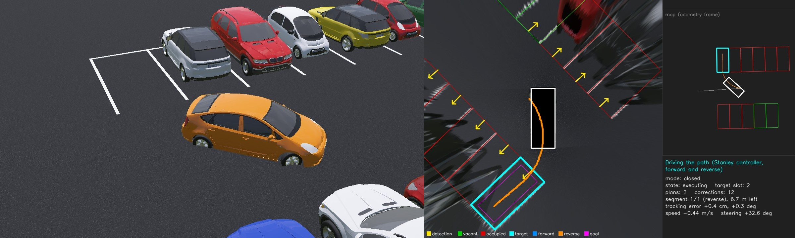
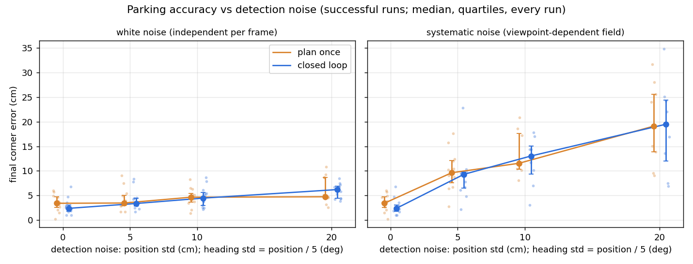
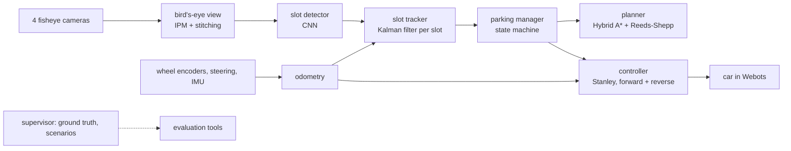

# Autopark: vision-based autonomous parking (Webots + ROS 2 Jazzy)

A simulated car drives along a parking aisle, finds a vacant slot using only its four fisheye
cameras and wheel odometry, plans a reversing manoeuvre and parks itself between the other
cars. Every part of the autonomy stack (perception, state estimation, motion planning and
control) is implemented from scratch in Python and measured against the simulator's ground
truth, which the stack itself never sees.



**Demo video (1 min 44 s):** [release v1.0](https://github.com/MHVVD/autopark/releases/tag/v1.0) ·
**Technical write-up:** [docs/writeup.md](docs/writeup.md)

## Results at a glance

- **Parks reliably and precisely.** In 12 held-out scenarios without injected noise the car
  parked every time, never came closer than 0.47 m to another car, and stopped a median of
  1-2 cm and 0.4 deg from the slot centre (at most 4 cm and 0.9 deg; table below).
- **Sees slots from any angle.** The slot detector finds 99.7 % of slots even when the car is
  turned more than 45 deg or already inside a slot (entrance error 1.6 cm median), and 100 %
  when driving along the aisle (1.0 cm).
- **Research question: does closing the perception loop help?** Re-detecting the slot and
  re-planning during the manoeuvre was compared with planning once, under increasing
  detection noise, in 168 runs. No contact occurred in any run, and the two strategies were
  equally accurate within about 1 cm at every noise level: the Kalman tracker already averages
  independent noise away before the plan is made, and systematic errors look the same from
  inside the slot. The closed loop needed two safeguards to be as safe as planning once
  ([write-up, section 4](docs/writeup.md#4-experiment-closing-the-perception-loop-under-detection-noise)).

| No injected noise, 12 scenarios | plan once | closed loop |
|---|---|---|
| parked without contact | 12 / 12 | 12 / 12 |
| minimum clearance to a parked car | 0.47 m | 0.50 m |
| final lateral error, median / max | 0.7 / 1.9 cm | 1.2 / 4.0 cm |
| final depth error, median / max | 1.7 / 2.5 cm | 0.2 / 1.0 cm |
| final heading error, median / max | 0.40 / 0.85 deg | 0.26 / 0.70 deg |
| time from start of search to parked (median) | 51 s | 50 s |



## How it works



### Simulation

A Webots world with two facing rows of eight perpendicular slots (2.6 m x 5.2 m) across a
7 m aisle. Each scenario is generated from a seed: which slots are empty, the models and
colours of the parked cars, their placement inside the slot (+-20 cm sideways, +-25 cm in
depth, +-3.4 deg) and the car's start pose. The ego car is a Toyota Prius with rate-limited
speed and steering actuators (`autopark_sim/vehicle_plugin.py`) and four 189 deg fisheye
cameras at 10 Hz, each image stamped with the exact simulation time of its render. A
supervisor publishes the ground truth (car pose, slots) for training labels and evaluation
only.

### Odometry

Ackermann dead reckoning from the rear-wheel encoders, with the heading integrated from the
IMU's gyro (`odometry.py`). Over a 25 m drive with turns and reversing the position error
stays below 1.8 cm and the heading error below 0.13 deg.

### Bird's-eye view

The four fisheye images are projected onto the ground plane and stitched into one 18 x 18 m
top-down image at 4 cm per pixel (`bev.py`). The camera model reproduces Webots' spherical
(equidistant) projection exactly; the rig geometry is defined once (`autopark_sim/rig.py`) and
used both to build the world and to warp the images, so the calibration is exact by
construction. A ground point is taken from a camera only if its line of sight clears the car's
own body (a box model plus per-camera masks measured in a calibration world), and overlapping
cameras are blended by viewing elevation. Painted lines appear within 6 cm of their true
position for 99.6 % of pixels at 3-6 m from the car, and 87 % at 6-9 m.

### Slot detector

A marking-point network (`slot_net.py`, 1.65 M parameters) on the bird's-eye view predicts
where each painted side line meets the aisle: a CenterNet-style heatmap with sub-pixel offset,
the direction into the slot, and a vacancy map. `slot_codec.py` pairs neighbouring points one
slot width apart into slots and averages the vacancy over the slot's front part. The heading
of a slot blends the direction of its painted lines with the normal of the 2.6 m entrance
segment, weighted towards the normal near the car, where the side lines are short stubs
partly hidden by the car body; this halves the heading error within 5 m. Inference takes
42 ms per frame on a laptop CPU.

Training data comes from the simulator with automatic labels: 7 600 views recorded while
driving along the aisle on randomised weaving paths (`collect_slots.py`), and 5 200 views
from arbitrary poses (`collect_poses.py`), for which a supervisor service teleports the car
along ground-truth parking paths, anywhere in the aisle at any heading, and into empty slots,
keeping the settled suspension so every image is at rest. Train, validation and test sets use
separate scenarios.

| test views | slots found | entrance error median | heading error p90 |
|---|---|---|---|
| driving along the aisle (1 126 images) | 100 % | 1.0 cm | 0.67 deg |
| car within 20 deg of the aisle (109) | 100 % | 0.9 cm | 0.61 deg |
| turned 20-45 deg (102) | 99.8 % | 1.2 cm | 0.90 deg |
| turned more than 45 deg or inside a slot (389) | 99.7 % | 1.6 cm | 1.27 deg |

### Slot tracker

One Kalman filter per slot on the entrance pose (x, y, heading) in the odometry frame
(`slot_tracker.py`). The measurement noise follows the detector's error as measured against
range; the prediction adds odometry drift proportional to the distance driven. Detections are
associated with tracks by a Mahalanobis gate (chi-square, 3 dof, 99.9 %) and linear
assignment. Tracks are confirmed after 3 hits and only count misses while the slot should be
visible, so slots are remembered when they leave the view during the manoeuvre. Vacancy is a
log-odds filter whose weight falls with range, since far-range vacancy calls are unreliable.
The fused entrance error is 0.8 cm median; even with injected noise of 35 cm median per
detection it stays at 4.8 cm.

### Planner

Hybrid A* (`hybrid_astar.py`) with Reeds-Shepp shots to the goal (`reeds_shepp.py`: the CSC,
CCC, CCCC, CCSC and CCSCC families with their symmetries, 44 candidate formulas, verified to
end exactly on the goal). The planning problem is built from perception only
(`parking_goal.py`):

- The goal is the rear-axle pose that centres the car in the tracked slot, facing out.
- A slot is a target only if its fused vacancy exceeds 0.95 from at least 3 close
  observations. Every other slot is a keep-out box, grown by the worst-case overhang of a
  parked car measured over 3 000 simulated scenarios (0.25 m towards the aisle, 0.05 m
  sideways); the band behind each row is keep-out too.
- Only explored space is drivable: the region the cameras have covered while driving along
  the aisle, chosen so that an unseen occupied slot can never look free (checked exhaustively
  in the tests).

The search uses 7 steering angles (minimum turning radius 4.57 m), 0.6 m arcs forward and in
reverse, and a cost on length, reversing, gear changes and steering. Collision checking keeps
a 10 cm margin around the car outline in a conservative distance field. On 214 planning
problems over 50 scenarios every problem was solved, every path was collision-free against the
true parked cars (min clearance 0.33 m), and the median planning time was 0.14 s.

### Controller

A Stanley path tracker per segment of constant direction (`stanley.py`): at the front axle
when driving forward, and at the rear axle with per-metre gains when reversing, so that errors
settle within about 2 m instead of the 5 m that speed-scaled Stanley gains need in reverse. A
curvature feed-forward follows the arcs; the speed profile slows to a crawl before every gear
change and every jump in steering (the actuator needs 1.4 s from full left to full right) and
stops while the steering lags its command; each segment starts with the wheels already turned.
With the actuator limits and delay modelled, the tracking error stays below 4.7 cm and the
final error below 1 cm.

### Parking manager

A state machine (`parking_manager_node.py`): **search** (follow the aisle centre line estimated
from the tracked slots) -> **stop** once a vacant slot has been passed by 3 m -> **plan** ->
**execute** -> done or failed. Two strategies:

- **Plan once** (`replan:=open`): drive the whole path as planned.
- **Closed loop** (`replan:=closed`): drive to the first gear change, re-plan there from the
  latest slot estimate, and on the final reverse move the remaining path with the tracked slot
  as it updates. If a re-plan fails, the rest of the previous, collision-checked plan is driven
  as planned; corrections stay within 15 cm of the planned goal.

### Visualizer

`/viz/image` shows the bird's-eye view with each frame's detections, the tracked slots
(vacant, occupied, target), the planned path (forward and reverse) and the goal, next to a map
of the manoeuvre and the state of the manager and controller (`visualizer.py`). For the demo
video, the supervisor also renders a follow camera off-screen.

## Getting started

Requirements: Ubuntu 24.04, ROS 2 Jazzy, Webots R2025a with `webots_ros2`, Python 3.12 with
PyTorch, OpenCV, SciPy and NumPy < 2. The trained detector is expected at
`~/autopark_models/slotnet_v2.pt` (train it as below, or pass `model:=<file>`).

```bash
mkdir -p ~/ws/src && cd ~/ws/src && git clone https://github.com/MHVVD/autopark.git
cd ~/ws && colcon build --symlink-install && source install/setup.bash

ros2 launch autopark bringup.launch.py seed:=5              # the car finds a vacant slot and parks
ros2 run rqt_image_view rqt_image_view /viz/image           # the stack's view (second terminal)
ros2 topic echo /parking/status                             # what the parking manager is doing
```

Useful launch arguments: `seed` (scenario), `gui:=false` (no 3D window), `mode:=fast`,
`replan:=open|closed`, `viz:=false`, and injected detection noise for experiments:
`noise_mode:=white|field noise_pos:=0.10 noise_yaw_deg:=2`.

Tests: `python3 -m pytest -q autopark_sim/test autopark/test` (with ROS sourced).

## Reproducing the results

Data collection needs the simulation running without the parking nodes:
`ros2 launch autopark bringup.launch.py gui:=false mode:=fast detector:=false tracker:=false planner:=false park:=false`.

```bash
# slot detector: datasets, training (CPU ~13 min per epoch; also runs on Colab), evaluation
ros2 run autopark collect_slots --ros-args -p seed_start:=10000 -p seed_count:=150 -p out_dir:=$HOME/autopark_data/slots_v1/train
ros2 run autopark collect_slots --ros-args -p seed_start:=10150 -p seed_count:=25 -p out_dir:=$HOME/autopark_data/slots_v1/val
ros2 run autopark collect_slots --ros-args -p seed_start:=0 -p seed_count:=30 -p out_dir:=$HOME/autopark_data/slots_v1/test
ros2 run autopark collect_poses --ros-args -p seed_start:=10200 -p seed_count:=200 -p out_dir:=$HOME/autopark_data/slots_v2/train
ros2 run autopark collect_poses --ros-args -p seed_start:=10400 -p seed_count:=30 -p out_dir:=$HOME/autopark_data/slots_v2/val
ros2 run autopark collect_poses --ros-args -p seed_start:=30 -p seed_count:=40 -p poses_per_seed:=15 -p out_dir:=$HOME/autopark_data/slots_v2/test
ros2 run autopark train_slots --data ~/autopark_data/slots_v1 --epochs 12 --out ~/autopark_models/slotnet.pt
ros2 run autopark train_slots --data ~/autopark_data/slots_v1:2,~/autopark_data/slots_v2 --init ~/autopark_models/slotnet.pt --out ~/autopark_models/slotnet_v2.pt --epochs 8 --lr 1e-3
ros2 run autopark eval_slots --data ~/autopark_data/slots_v2 --split test
```

**Training on Colab (GPU):** upload `autopark/autopark`, `autopark_sim/autopark_sim` (pure
Python, no ROS needed) and the dataset, `!pip install opencv-python-headless`, then
`!PYTHONPATH=. python -m autopark.train_slots --data slots_v1 --out slotnet.pt --workers 2`.

Evaluation tools, all scored against ground truth (`park:=false` for the ones that drive the
car themselves):

| tool | measures |
|---|---|
| `odom_eval` + `drive_test` | odometry drift along a scripted drive |
| `bev_eval` | painted lines in the bird's-eye view vs their true positions |
| `eval_slots` | detector precision, recall and errors by range and viewing angle |
| `track_eval` | tracker accuracy, consistency and memory while driving past the rows and back |
| `plan_bench`, `plan_eval` | planner success, clearance and time, offline and on the live stack |
| `park_eval` | full autonomous runs: success, contact, final pose error, time |
| `noise_report` | the detection-noise experiment: table, paired statistics, plots |

The noise experiment runs `park_eval` for scenarios 100-111 in each condition, e.g.

```bash
ros2 launch autopark bringup.launch.py gui:=false mode:=fast replan:=closed noise_mode:=field noise_pos:=0.10 noise_yaw_deg:=2
ros2 run autopark park_eval --ros-args -p use_sim_time:=true -p "seeds:=[100,101,102,103,104,105,106,107,108,109,110,111]" -p label:=closed_field_10 -p out:=$HOME/autopark_results/noise_sweep
ros2 run autopark noise_report --dir ~/autopark_results/noise_sweep
```

Demo video: launch with `record:=<dir>` to save the visualizer frames and the follow camera,
then combine recordings, title cards and plots with `ros2 run autopark make_demo_video`.

## Repository layout

- `autopark_msgs`: messages (`ParkingSlot`, `ParkingSlotArray`, `ParkingPath`,
  `ControlStatus`, `ParkingStatus`) and services (`ResetScenario`, `SetPose`, `PlanParking`).
- `autopark_sim`: the Webots world (generated from `lot.py` by `generate_world.py`), scenario
  generation, the vehicle plugin and the ground-truth supervisor. Geometry, scenario and
  vehicle maths live in modules without ROS imports.
- `autopark`: the autonomy stack (one node per box in the diagram), the evaluation tools and
  the tests.
- `docs`: the technical write-up and figures.

After changing `lot.py`, `scenario.py` or the cameras, regenerate the world with
`python3 -m autopark_sim.generate_world worlds` (in `autopark_sim/`).

## Interfaces

| Topic / service | Type | Notes |
|---|---|---|
| `/cmd_ackermann` | ackermann_msgs/AckermannDriveStamped | speed m/s (+fwd), steering rad (+left); rate limited, 0.5 s timeout |
| `/vehicle/state` | ackermann_msgs/AckermannDriveStamped | speed from rear-wheel encoders, steering from steering joints, 50 Hz |
| `/imu` | sensor_msgs/Imu | gyro + accelerometer, 50 Hz |
| `/cam_{front,rear,left,right}/image` | sensor_msgs/Image | 640x640 equidistant fisheye, 189 deg, 10 Hz, stamped with the simulation time of the render |
| `/odom` + TF odom->base_link | nav_msgs/Odometry | Ackermann dead reckoning, heading from the IMU |
| `/bev/image` | sensor_msgs/Image | bird's-eye view, 18 x 18 m at 4 cm/px, frame base_footprint |
| `/slots/detections` | autopark_msgs/ParkingSlotArray | detected slots in base_footprint (entrance, heading, width, vacancy, confidence) |
| `/slots/detections_noisy` | autopark_msgs/ParkingSlotArray | detections after optional injected noise (pass-through by default); the tracker's input |
| `/slots/tracked` | autopark_msgs/ParkingSlotArray | confirmed slot tracks in odom: id, entrance, covariance, fused vacancy |
| `/parking/plan` | autopark_msgs/srv/PlanParking | plan into a tracked slot (`slot_id`, -1 = nearest vacant) |
| `/parking/path`, `/parking/path_exec` | autopark_msgs/ParkingPath | the latest plan, and what the controller follows; rear-axle poses every 0.1 m with gear and curvature |
| `/parking/status`, `/parking/control_status` | ParkingStatus, ControlStatus | parking manager and controller state |
| `/viz/image` | sensor_msgs/Image | the visualizer |
| `/ground_truth/pose`, `/ground_truth/slots` | Odometry, ParkingSlotArray | evaluation and labels only, never used by the stack |
| `/ground_truth/reset`, `/ground_truth/set_pose` | ResetScenario, SetPose | deterministic scenario from a seed; teleport the car (data collection) |

Conventions: `map` frame x along the aisle, y across; `base_link` at the rear-axle centre,
x forward, y left. All messages are stamped with simulation time.

## Limitations

- Simulation only: perfect calibration, clean painted lines, no weather or lighting changes,
  one lot layout (perpendicular slots). Only perpendicular reverse-in parking.
- Obstacles other than parked cars in slots (pedestrians, pillars, a car in the aisle) are not
  detected; a real system would add a free-space map.
- Planning and control assume the kinematic bicycle model at parking speed (below 1 m/s).

## License

MIT, see [LICENSE](LICENSE).
