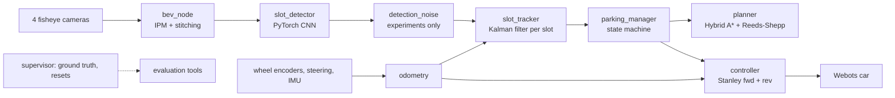
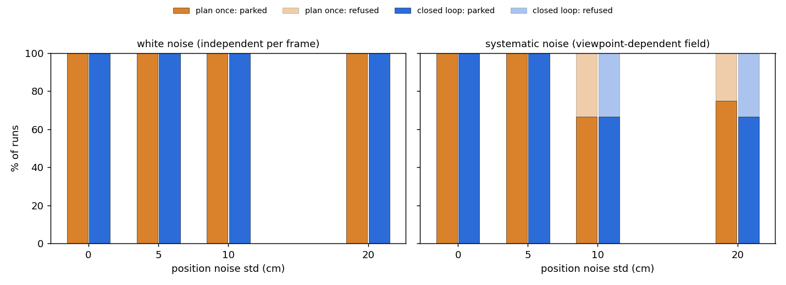

# Vision-based autonomous parking: technical write-up

A simulated car (Webots, ROS 2 Jazzy) drives along a parking aisle, finds a vacant slot with
four fisheye cameras and reverses into it by itself. Every module (perception, estimation,
planning, control) is built from scratch and measured against simulator ground truth, which
the stack itself never uses. The research question: **does closing the perception loop
(re-detecting and re-planning during the manoeuvre) park more accurately than planning once,
especially as detection noise grows?**

**Answer: not measurably.** Over 168 runs (7 noise conditions x 2 modes x the same 12
scenarios) both modes parked equally often, with no contact in any run, and the final
corner error of closed loop and plan once was within about 1 cm at every noise level
(paired Wilcoxon p >= 0.23). Independent per-frame noise is already averaged away by the
Kalman tracker before the plan is made, and systematic, viewpoint-dependent errors are just
as present in the close-range views, so re-detecting brings different errors rather than
smaller ones. Closing the loop did improve depth accuracy without noise (median 0.2 cm vs
1.7 cm), and the experiment exposed two ways in which a naive closed loop is *less* safe
than planning once; both are fixed (section 4.3).


## 1. System



| Module | Method | Measured (vs ground truth) |
|---|---|---|
| Odometry | Ackermann dead reckoning on rear-wheel encoders, heading from the IMU gyro | 1.8 cm position, 0.13 deg heading error after a 25 m drive with turns and reversing |
| Bird's-eye view | Equidistant fisheye model matching Webots' spherical projection, inverse perspective mapping onto the ground, own-body occlusion masks, blending by viewing elevation; 18 x 18 m at 4 cm/px | painted lines within 6 cm of their true position: 99.6 % at 3-6 m, 87 % at 6-9 m from the car |
| Slot detector | Marking-point CNN (1.65 M parameters, CenterNet-style heatmap + offset + direction + vacancy heads) on the BEV; neighbouring points paired into slots; 42 ms per frame on a laptop CPU | aisle views: 100 % recall and precision, entrance error 1.0 cm median; turned / in-slot views: 99.7 % recall, 1.6 cm (after retraining, section 3) |
| Slot tracker | Kalman filter per slot entrance (x, y, heading) in the odometry frame; Mahalanobis gating, linear assignment; misses only counted when the slot should be visible; range-weighted log-odds vacancy | 0.8 cm median entrance error; with injected noise of 35 cm median per detection, 4.8 cm |
| Planner | Hybrid A* (7 steering angles, reverse and gear-change costs) with Reeds-Shepp shots; obstacles from perception only (every slot not confidently vacant, the band behind each row, unexplored space) | 214/214 offline problems solved, all collision-free against the true parked cars (min clearance 0.33 m), median 0.14 s |
| Controller | Stanley: front axle forward, rear axle in reverse with per-metre gains; curvature feed-forward; creep before cusps and steering jumps; waits for the wheels at standstill | 4.7 cm max tracking error, < 1 cm at the goal (kinematic model); live: see section 4 |
| Parking manager | SEARCH (follow the aisle estimated from the tracks) -> stop once a vacant slot is passed -> PLAN -> EXECUTE. `open`: execute the whole plan. `closed`: execute up to the first cusp, re-plan there with the latest estimate, and move the final reverse with the tracked slot as it updates | |

Safety is enforced by construction rather than tuned: a slot is a target only if its fused
vacancy exceeds 0.95 from at least 3 close observations; the planner treats every other slot
as a keep-out box grown by the measured worst-case overhang of a parked car, and may only
drive where the cameras have looked (a slot entrance can only be unseen outside the explored
region, checked exhaustively in the tests).

## 2. Evaluation method

Scenarios are generated from a seed (which of the 16 slots are empty, parked-car models,
colours and placement jitter of +-20 cm / +-25 cm / +-3.4 deg, the car's start pose), so
every comparison is on identical scenarios. A run succeeds if the manager reports "parked",
the car's true footprint is inside the lines of a truly empty slot, and the true car
rectangle never touched a true parked car (exact polygon geometry). Accuracy is measured on
the true final pose relative to the slot's centre line.

## 3. Seeing slots from any angle

The first detector was trained on views collected while driving along the aisle. Measured
on 600 test views from arbitrary poses, it found 99.9 % of slots when the car was within 20
deg of the aisle direction, 70 % at 20-45 deg, and **0 %** beyond 45 deg, i.e. during most of
the manoeuvre and from inside the slot. The closed loop therefore had no information during
the final reverse. A teleport service in the ground-truth supervisor (which keeps the settled
suspension so every image is at rest) collected 5 200 labelled views: along ground-truth
parking paths, anywhere in the aisle at any heading, and inside empty slots. Fine-tuning on
these plus the aisle images gave 99.7 % recall beyond 45 deg with a 1.6 cm median entrance
error, and no loss on aisle views.

Live, the new detector first made the closed loop worse (lateral error up to 12 cm). Tracing
the goal the controller steered to showed it swinging by +-10 cm in step with the estimated
slot heading: the goal lies 4 m inside the slot, so 1 deg of heading error moves it 7 cm.
Positions, time stamps and odometry were all accurate; the heading came from the painted side
lines, which near the car are short stubs partly hidden by the car body. Blending in the
normal of the 2.6 m entrance segment, weighted by range, halved the near-range heading error
and fixed it (8 scenarios: closed loop depth error max 0.5 cm vs 2.9 cm for plan once).


## 4. Experiment: closing the perception loop under detection noise

### 4.1 Design

- **Modes.** *Plan once* (`open`): plan at the stop and drive the whole path. *Closed loop*
  (`closed`): drive to the first cusp, re-plan there from the latest slot estimate, and move
  the final reverse with the tracked slot as it updates (small rigid corrections).
- **Noise** is injected between the detector and the tracker (the tracker is told its size):
  - *white*: independent Gaussian noise on every detection's entrance position and heading;
  - *systematic*: a smooth random error field over the car frame (wavelength 6 m), the same
    in every frame for the same viewpoint, as a slightly wrong camera calibration would give.
    It is redrawn for every scenario, identically for both modes.
  - Levels: position std 0, 5, 10 and 20 cm with heading std 0, 1, 2 and 4 deg.
- **Scenarios** 100-111 (not used during development), the same in every condition; 7
  conditions x 2 modes x 12 = 168 runs, compared per scenario (paired).
- **Metric.** Corner error: the largest distance between a corner of the parked car and where
  it would be if the car were exactly centred and aligned; plus success, contact and clearance.

### 4.2 Results

| noise | mode | parked (no contact) | refused | corner error median (IQR) cm | depth median / max cm | closed - open, paired |
|---|---|---|---|---|---|---|
| none | plan once | 12/12 | 0 | 3.4 (2.5-4.7) | 1.7 / 2.5 | |
| none | closed loop | 12/12 | 0 | 2.4 (1.8-3.1) | 0.2 / 1.0 | -0.7 cm, better in 8/12, p = 0.23 |
| white 5 cm / 1 deg | plan once | 12/12 | 0 | 3.5 (3.0-5.1) | 0.7 / 3.3 | |
| white 5 cm / 1 deg | closed loop | 12/12 | 0 | 3.4 (2.8-4.5) | 0.7 / 2.3 | -0.4 cm, better in 8/12, p = 0.62 |
| white 10 cm / 2 deg | plan once | 12/12 | 0 | 4.7 (3.7-5.4) | 1.3 / 1.8 | |
| white 10 cm / 2 deg | closed loop | 12/12 | 0 | 4.5 (2.9-5.6) | 0.6 / 2.7 | -0.5 cm, better in 7/12, p = 0.85 |
| white 20 cm / 4 deg | plan once | 12/12 | 0 | 4.7 (4.5-8.6) | 1.7 / 4.5 | |
| white 20 cm / 4 deg | closed loop | 12/12 | 0 | 6.2 (4.4-6.9) | 1.2 / 3.1 | +1.1 cm, better in 4/12, p = 0.91 |
| systematic 5 cm / 1 deg | plan once | 12/12 | 0 | 9.6 (7.6-12.1) | 2.9 / 11.3 | |
| systematic 5 cm / 1 deg | closed loop | 12/12 | 0 | 9.3 (6.5-9.8) | 2.8 / 5.5 | -0.1 cm, better in 6/12, p = 0.79 |
| systematic 10 cm / 2 deg | plan once | 8/12 | 4 | 11.6 (10.3-17.6) | 4.6 / 18.2 | |
| systematic 10 cm / 2 deg | closed loop | 8/12 | 4 | 13.0 (9.4-15.0) | 5.4 / 16.0 | -0.1 cm, better in 4/8, p = 0.64 |
| systematic 20 cm / 4 deg | plan once | 9/12 | 3 | 19.1 (13.9-25.6) | 5.6 / 26.7 | |
| systematic 20 cm / 4 deg | closed loop | 8/12 | 4 | 19.5 (12.0-24.4) | 6.5 / 31.9 | -0.2 cm, better in 4/8, p = 0.84 |




- **No contact in any of the 168 runs**; the smallest clearance to a true parked car was
  0.17 m (systematic noise 20 cm). "Refused" runs are safe failures: the estimated goal
  overlapped a neighbour's keep-out box, so no slot was accepted and the car drove on. Heading
  noise does this: 4 deg swings a 5.2 m deep neighbouring slot by up to 0.36 m at its back.
- **White noise** hardly matters for either mode (median corner error 3.4 -> 4.7 cm for plan
  once at 20 cm / 4 deg per detection): the tracker fuses hundreds of detections per slot.
- **Systematic noise** degrades both modes equally (median 3.4 -> 19 cm). A slot seen from
  the aisle and from inside the slot has different, not smaller, errors, and the tracker keeps
  averaging all of them.
- **Where closed loop helps**: depth without noise (0.2 vs 1.7 cm median; the close views
  measure the distance to the entrance better), and it follows the true slot when odometry or
  the first estimate is off. **Where it does not**: overall accuracy under noise, which is
  bounded by the estimate, not by planning or control: plan once follows its path to within
  0.5 cm median (5 cm max). Closed loop's own tracking error is larger (median 3 cm with white,
  5.5 cm with systematic noise, max 16 cm) because every correction moves the path under the
  car, which the controller then has to catch up with.

### 4.3 What the experiment exposed

Closed loop needed two safeguards before it was as safe and as available as planning once.
The first runs (kept as `*_v1`, `*_v2` in the results) showed:

| systematic noise | closed loop v1 | + fall back to the previous plan | + bound on the total correction | plan once |
|---|---|---|---|---|
| 5 cm / 1 deg | 9/12, min clearance 0.17 m | 12/12, 0.16 m | 12/12, 0.33 m | 12/12, 0.33 m |
| 10 cm / 2 deg | 4/12, 0.24 m | 7/12, 0.12 m | 8/12, 0.49 m | 8/12, 0.45 m |
| 20 cm / 4 deg | 4/12, 0.24 m | 9/12, 0.19 m | 8/12, 0.17 m | 9/12, 0.19 m |

1. **Stranded mid-manoeuvre.** Re-planning at the cusp with the latest estimate often failed
   (the goal now overlapped a neighbour's keep-out box), and the car stopped half-way. Now the
   rest of the previous, collision-checked plan is driven as planned.
2. **Drifting corrections.** Each correction of the final reverse was limited to 25 cm, but
   only relative to the previous one, so under systematic noise many small steps could walk
   the goal away from the path the planner had checked (one run ended outside the slot lines,
   0.12 m from a parked car). The corrected goal now stays within 15 cm of the planned goal.

One apparent contact in the noise-free plan-once condition turned out to be an evaluation
artefact: under CPU load, ground-truth poses queued from the previous run (the car parked in
another slot, where the new scenario has a car) were recorded as the start of the next run.
Three replays of that scenario were clean (0.64 m clearance); the evaluator now starts the
trajectory at the scenario's start pose and counts the dropped poses (one per run, since).


## 5. Limitations

- Simulation only: perfect camera calibration, no lens dirt, rain or lighting changes, and
  painted lines are always clean. The detector is trained and tested on this one lot layout
  (perpendicular slots, 2.6 m wide).
- Obstacles that are not parked cars in slots (pedestrians, pillars, a car in the aisle) are
  not detected; a real system needs a free-space or occupancy map.
- The injected noise is a model. Real detector errors are neither independent per frame nor a
  fixed field; the two kinds bracket the behaviour. 12 scenarios per condition detect
  differences of a few cm at best; smaller effects would need more runs.
- The safeguards make closed loop as safe as planning once, not safer: corrections are bounded
  rather than collision-checked against the latest estimate.
- The controller and planner assume the kinematic bicycle model at parking speed (< 1 m/s).

## 6. Reproduce

See the README (`Run`, and each module's section). Experiment:

```bash
ros2 launch autopark bringup.launch.py gui:=false mode:=fast replan:=closed noise_mode:=field noise_pos:=0.10 noise_yaw_deg:=2
ros2 run autopark park_eval --ros-args -p use_sim_time:=true -p "seeds:=[100,101,102]" -p label:=closed_field_10 -p out:=$HOME/autopark_results/noise_sweep
ros2 run autopark noise_report --dir ~/autopark_results/noise_sweep
```

Demo video: record runs with `record:=<dir>` (the visualizer and the supervisor's demo camera
save frames), then `ros2 run autopark make_demo_video` (see its `--help`).
