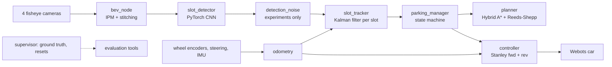

# Vision-based autonomous parking: technical write-up

A simulated car (Webots, ROS 2 Jazzy) drives along a parking aisle, finds a vacant slot with
four fisheye cameras and reverses into it by itself. Every module (perception, estimation,
planning, control) is built from scratch and measured against simulator ground truth, which
the stack itself never uses. The research question: **does closing the perception loop
(re-detecting and re-planning during the manoeuvre) park more accurately than planning once,
especially as detection noise grows?**

<!-- RESULTS-SUMMARY -->

## 1. System



| Module | Method | Measured (vs ground truth) |
|---|---|---|
| Odometry | Ackermann dead reckoning on rear-wheel encoders, heading from the IMU gyro | 1.8 cm position, 0.13 deg heading error after a 25 m drive with turns and reversing |
| Bird's-eye view | Equidistant fisheye model matching Webots' spherical projection, inverse perspective mapping onto the ground, own-body occlusion masks, blending by viewing elevation; 18 x 18 m at 4 cm/px | painted lines within 6 cm of their true position: 99.6 % at 3-6 m, 87 % at 6-9 m from the car |
| Slot detector | Marking-point CNN (1.65 M parameters, CenterNet-style heatmap + offset + direction + vacancy heads) on the BEV; neighbouring points paired into slots; 42 ms per frame on a laptop CPU | aisle views: 100 % recall and precision, entrance error 1.0 cm median; turned / in-slot views: 99.7 % recall, 1.6 cm (after retraining, section 3) |
| Slot tracker | Kalman filter per slot entrance (x, y, heading) in the odometry frame; Mahalanobis gating, linear assignment; misses only counted when the slot should be visible; range-weighted log-odds vacancy | 0.8 cm median entrance error; with injected noise of 35 cm median per detection, 4.8 cm |
| Planner | Hybrid A* (7 steering angles, reverse and gear-change costs) with Reeds-Shepp shots; obstacles from perception only (every slot not confidently vacant, the band behind each row, unexplored space) | 214/214 offline problems solved, all collision-free against the true parked cars (min clearance 0.33 m), median 0.14 s |
| Controller | Stanley: front axle forward, rear axle in reverse with per-metre gains; curvature feed-forward; creep before cusps and steering jumps; waits for the wheels at standstill | 4.7 cm max tracking error, < 1 cm at the goal (kinematic model); live: see section 4 |
| Parking manager | SEARCH (follow the aisle estimated from the tracks) -> stop once a vacant slot is passed -> PLAN -> EXECUTE. `open`: execute the whole plan. `closed`: execute up to the first cusp, re-plan there with the latest estimate, and move the final reverse with the tracked slot as it updates | |

Safety is enforced by construction rather than tuned: a slot is a target only if its fused
vacancy exceeds 0.95 from at least 3 close observations; the planner treats every other slot
as a keep-out box grown by the measured worst-case overhang of a parked car, and may only
drive where the cameras have looked (a slot entrance can only be unseen outside the explored
region, checked exhaustively in the tests).

## 2. Evaluation method

Scenarios are generated from a seed (which of the 16 slots are empty, parked-car models,
colours and placement jitter of +-20 cm / +-25 cm / +-3.4 deg, the car's start pose), so
every comparison is on identical scenarios. A run succeeds if the manager reports "parked",
the car's true footprint is inside the lines of a truly empty slot, and the true car
rectangle never touched a true parked car (exact polygon geometry). Accuracy is measured on
the true final pose relative to the slot's centre line.

<!-- SECTION-3 -->

<!-- SECTION-4 -->

## 5. Limitations

- Simulation only: perfect camera calibration, no lens dirt, rain or lighting changes, and
  painted lines are always clean. The detector is trained and tested on this one lot layout
  (perpendicular slots, 2.6 m wide).
- Obstacles that are not parked cars in slots (pedestrians, pillars, a car in the aisle) are
  not detected; a real system needs a free-space or occupancy map.
- The injected noise is a model. Real detector errors are neither independent per frame nor a
  fixed field; the two kinds bracket the behaviour.
- The controller and planner assume the kinematic bicycle model at parking speed (< 1 m/s).

## 6. Reproduce

See the README (`Run`, and each module's section). Experiment:

```bash
ros2 launch autopark bringup.launch.py gui:=false mode:=fast replan:=closed noise_mode:=field noise_pos:=0.10 noise_yaw_deg:=2
ros2 run autopark park_eval --ros-args -p use_sim_time:=true -p "seeds:=[100,101,102]" -p label:=closed_field_10 -p out:=$HOME/autopark_results/noise_sweep
ros2 run autopark noise_report --dir ~/autopark_results/noise_sweep
```
